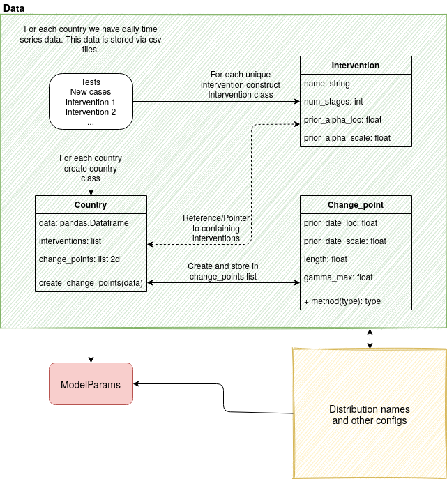

Data & ModelParams
----------------------

We apply a utility/abstraction layer to our data to simplify plotting and other operations later.

Before we can construct our model Parameters, we have to import and manipulate/restructure our data a bit as follows:

Data
^^^^^^^

.. autoclass:: covid19_npis.data.Country
		:members:
.. autoclass:: covid19_npis.data.Intervention
		:members:
		:private-members:
.. autoclass:: covid19_npis.data.Change_point
		:members:
		:private-members:

ModelParams
^^^^^^^^^^^

.. autoclass:: covid19_npis.ModelParams
    :members:
    :private-members:
