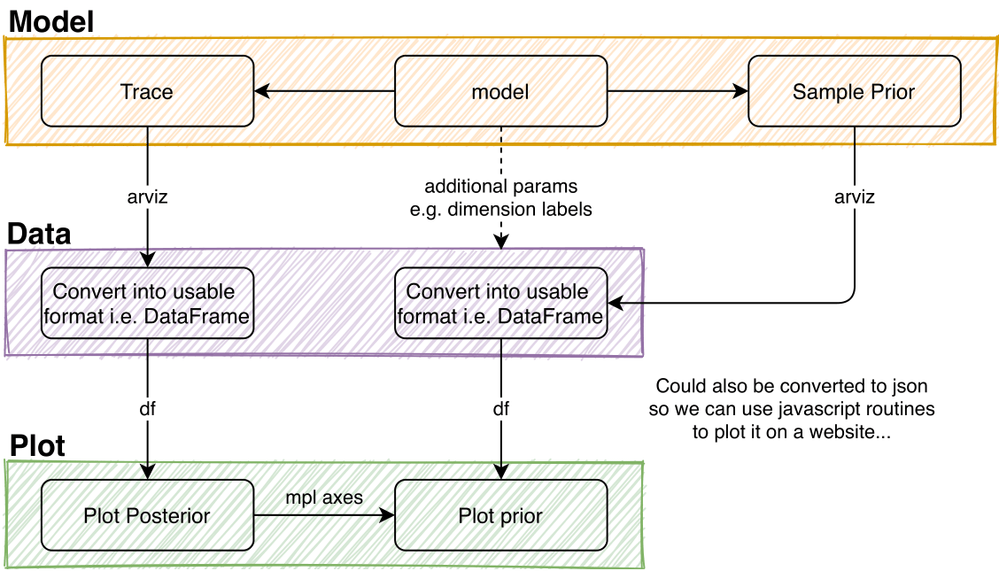

Plot
----

There are multiple stages involved before one can start to plot the obtained data.

- For model description, see :ref:`Model`.

- Trace data can be converted with :py:func:`covid19_npis.data.convert_trace_to_pandas_list`.

- Plotting WIP

Data converter
^^^^^^^^^^^^^^

.. autofunction:: covid19_npis.data.convert_trace_to_dataframe_list
.. autofunction:: covid19_npis.data.convert_trace_to_dataframe

Distribution
^^^^^^^^^^^^

.. automodule:: covid19_npis.plot.distributions
    :members:
    :private-members:

Time series
^^^^^^^^^^^

.. automodule:: covid19_npis.plot.time_series
    :members:
    :private-members:
